# 📚 Book Reviews Sentiment Analysis

This project predicts whether a person **liked a book or not** based on their written review using Natural Language Processing (NLP) and Machine Learning techniques.

---

## 🔍 Objective

Predict user sentiment about books from free-form text reviews.

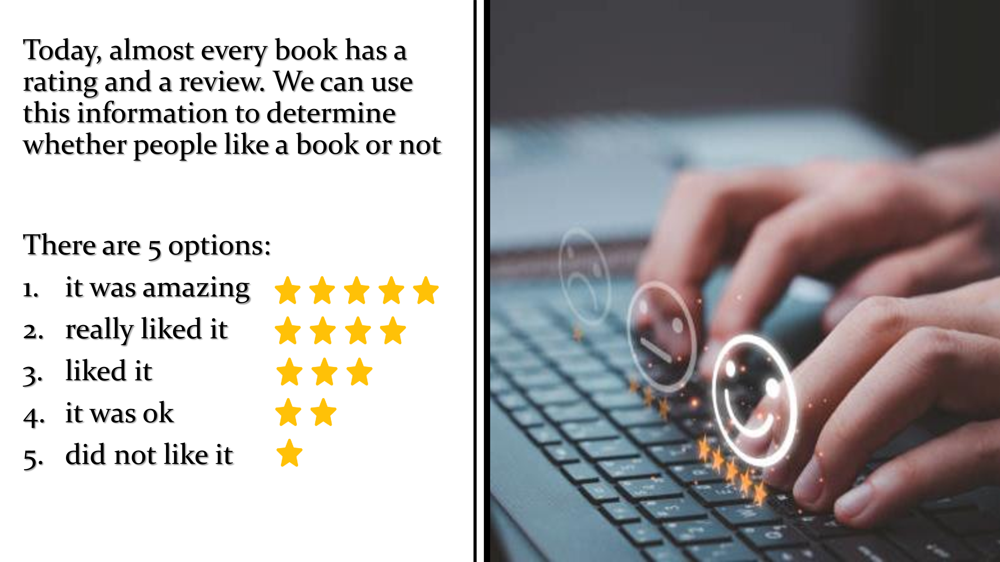

---

## 📊 Dataset

- **Source:** [Goodreads](https://www.goodreads.com)
- **Size:** ~125K reviews after cleaning
- **Fields collected:**  
  Book metadata, review text, ratings, user engagement, genres, etc.
- **Target variable:**  
  - `1` → Like (rating ≥ 4)  
  - `0` → Dislike (rating ≤ 3)

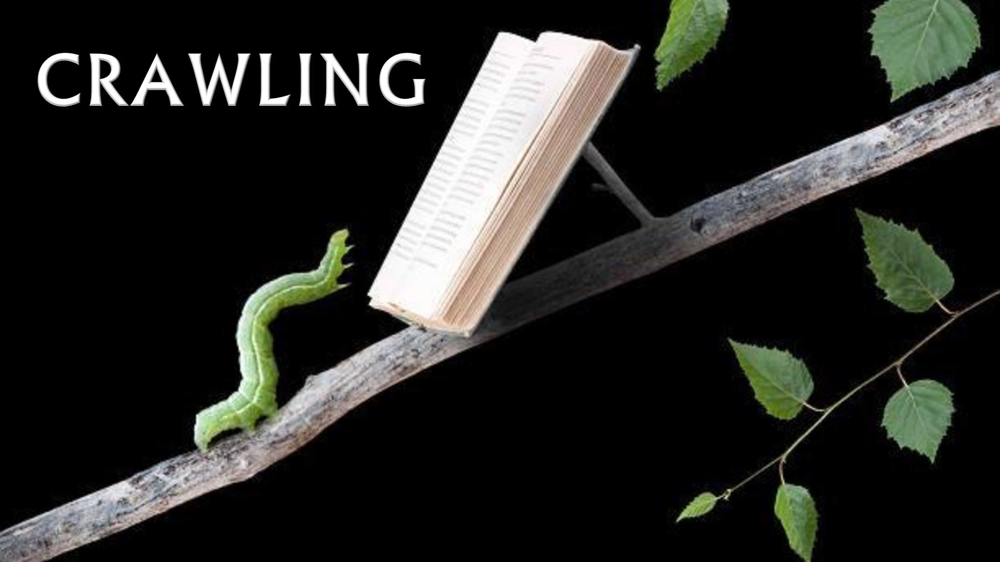

---

## ⚙️ Methodology

### 🧹 Data Cleaning & Preprocessing
- Dropped NaN & duplicates
- Normalized numerical columns
- Grouped genre & cover categories
- Converted years, extracted metadata
- Balanced classes (like/dislike)

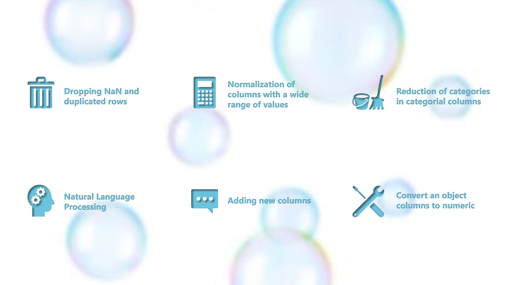
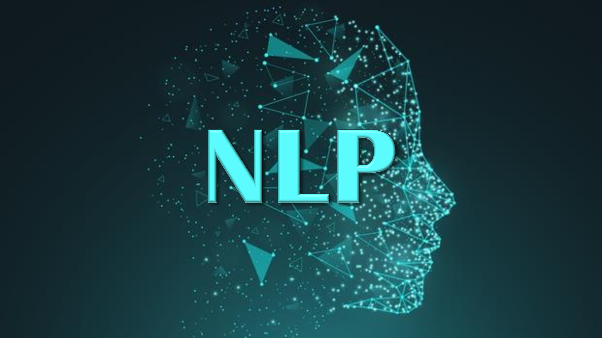

---

### 🧠 NLP Feature Engineering

- Tokenization, POS tagging, lemmatization
- Stop words removal
- Positive & negative word lists
- Word counts, vectorized terms (CountVectorizer)
- Custom columns: `num_positive`, `num_negative`, etc.

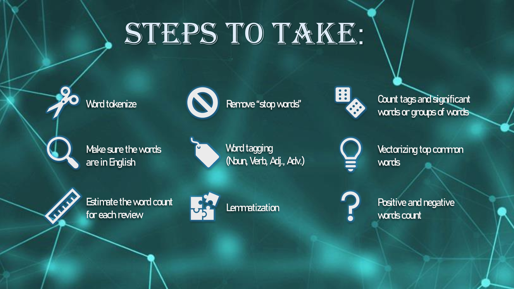
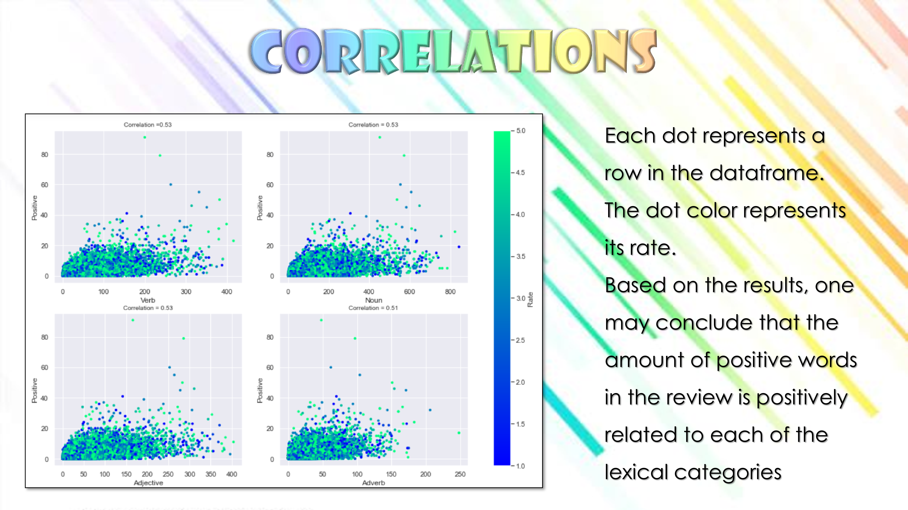
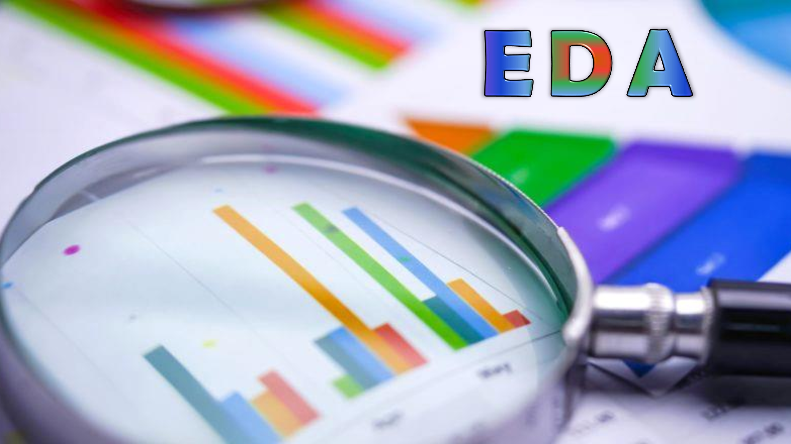

---

### 📈 Exploratory Data Analysis

- Correlation heatmap using Spearman
- Word sentiment trends
- Distribution of review types and sentiment

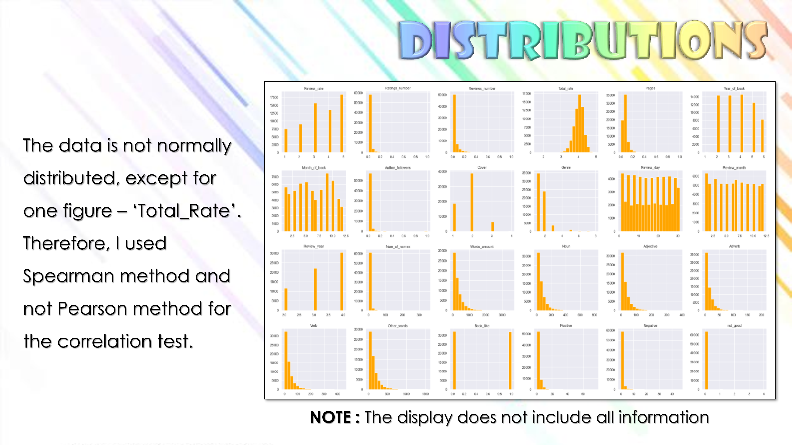
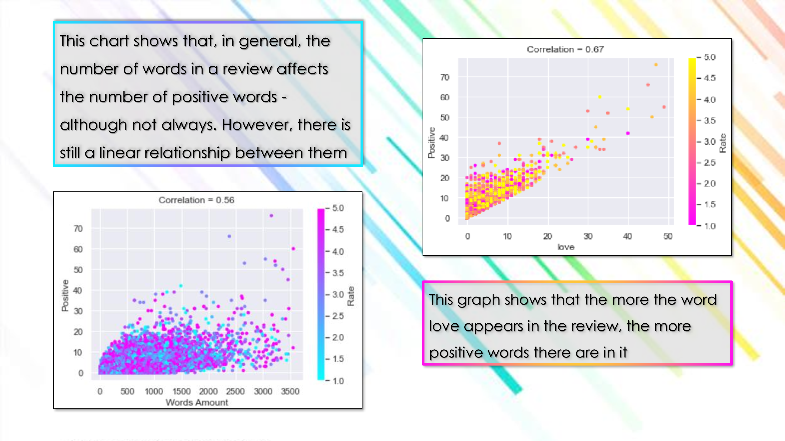
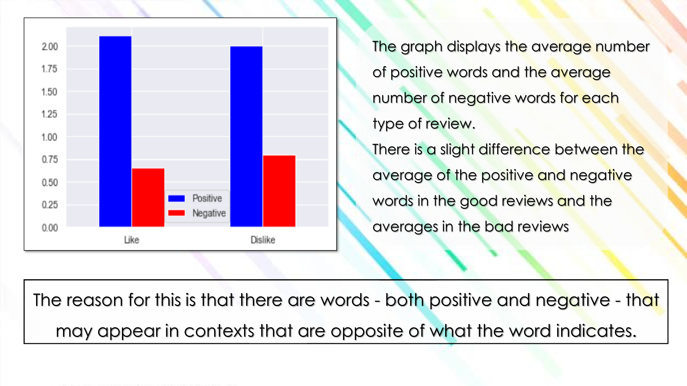

---

## 🤖 Machine Learning Model

- **Model used:** `AdaBoostClassifier`
- Dropped string and label-leaking columns
- Trained on 80% of the data, tested on 20%
- **Accuracy:** 57%

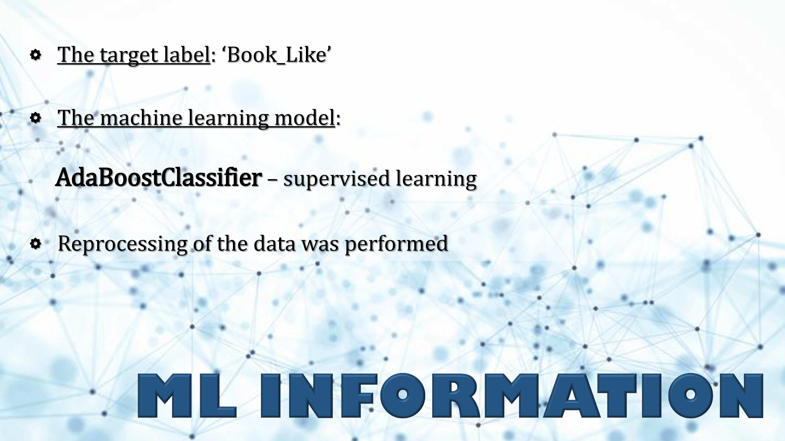

---

## 🧪 Technologies Used

- `Python`
- `Selenium` (data scraping)
- `Pandas`, `NumPy`
- `Scikit-learn`
- `NLTK`
- `Matplotlib`, `Seaborn`

---

## 📎 Presentation

🎞️ View the full presentation: [BooksReviews.pdf](BooksReviews.pdf)
