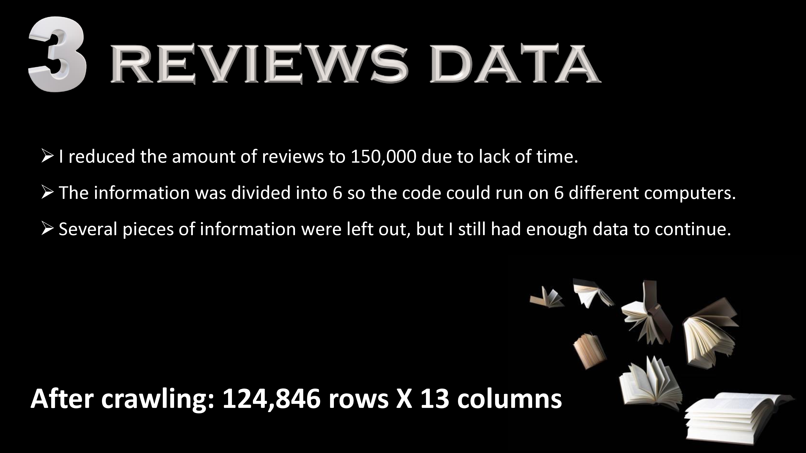

# 📚 Book Reviews Sentiment Analysis

This project predicts whether a person **liked a book or not** based on their written review using Natural Language Processing (NLP) and Machine Learning techniques.

---

## 🎯 Objective & Target Variable

The goal is to predict the sentiment of a book review by classifying it as either "Like" or "Dislike", based on the reviewer’s rating.

  
  
<i>Figure 1: Mapping Goodreads ratings to binary labels</i>

We define the labels as:

| ⭐ Rating | 🔖 Label | Sentiment |
|----------|---------|-----------|
| 4 or 5   | 1       | Like      |
| 1 to 3   | 0       | Dislike   |

Neutral ratings (such as 3) are considered **dislike** for binary classification.

---

## 📚 Data Source

All data was crawled from [Goodreads](https://www.goodreads.com), one of the largest platforms for book reviews.

> ⚠️ This project was conducted strictly for **educational and non-commercial research purposes**. No private or copyrighted content was stored or redistributed.

---

## 🕷️ Crawling Process

To build the dataset, I used **Selenium** to automate browsing and scraping Goodreads reviews.

### Step 1: Authentication

To avoid getting blocked or stuck while scraping, I first logged into Goodreads using automated credentials:

  
  
<i>Figure 1: Programmatic login using Selenium</i>

---

### Step 2: Collecting Book Metadata

After authentication, I navigated through **100 pages**, each listing **100 books**. For every book, I collected:

- Rating & number of ratings  
- Number of reviews  
- Genre & cover type  
- Author’s follower count  
- Link to the full review

  
  
<i>Figure 2: Fields collected per book</i>

---

### Step 3: Visiting Review Pages

Next, I followed each review link to extract the full review text and score. This step yielded a rich dataset that combines metadata with user-generated text.

  
  
<i>Figure 3: Final review dataset after crawling</i>

---

By the end of crawling, I had reduced the number of reviews to **150,000**. The final size was **~125,000 entries across 13 features**.

---

## ⚙️ Methodology

### 🧹 Data Cleaning & Preprocessing
- Dropped NaN & duplicates
- Normalized numerical columns
- Grouped genre & cover categories
- Converted years, extracted metadata
- Balanced classes (like/dislike)

---

### 🧠 NLP Feature Engineering

- Tokenization and lemmatization
- POS tagging (noun, verb, adj, adv)
- Word counts and stop word removal
- Positive/negative word lists
- Custom features: word counts, tag frequencies

---

## 📈 Exploratory Data Analysis (EDA)

### Correlation Analysis

Used **Spearman correlation** due to non-normal distribution as shown:

The correlations:

### Data Analysis via Visualization

---

## 🤖 Machine Learning Model

I used the **AdaBoostClassifier** from `scikit-learn` after comparing multiple options.

- Dropped all text and label-leaking features
- Final feature set included engineered numeric/textual columns
- Train/test split: 80% / 20%

---

## 📉 Results

The model’s performance on the test set:

- **Accuracy:** 57%  
- **Precision:** 56.6%  
- **Recall:** 58.2%  
- **F1 Score:** 57.4%

---

## 🧪 Technologies Used

- `Python`
- `Selenium` (data scraping)
- `Pandas`, `NumPy`
- `Scikit-learn`
- `NLTK`
- `Matplotlib`, `Seaborn`

---

## 🙌 Resources Used

- [Stack Overflow](https://stackoverflow.com)
- [Scikit-learn](https://scikit-learn.org)
- [Neptune.ai](https://neptune.ai)
- [Goodreads](https://www.goodreads.com)

---

## 📎 Presentation

🎞️ View the full presentation: [BooksReviews.pdf](BooksReviews.pdf)

---

## 🙋 Author

Developed as an independent academic project.
